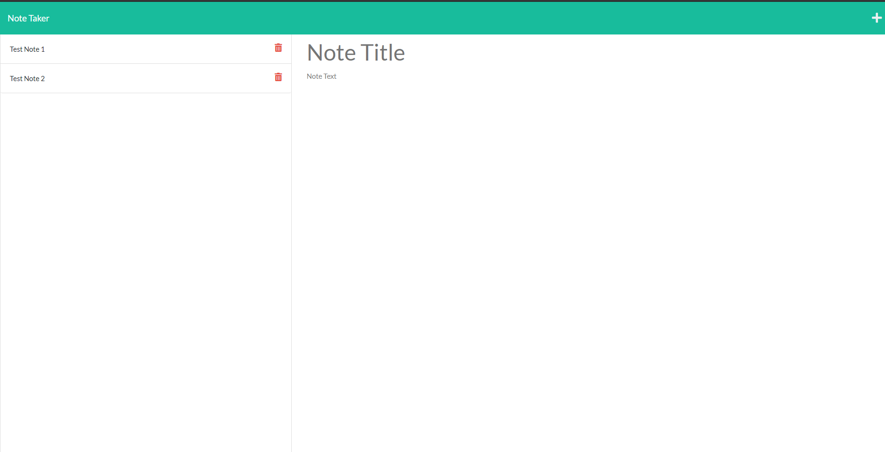

# Note Taker 

  
  
  ## Description 

  This is a Note recording application that stores user generated note on a server
  
  ## Table of Contents
  
  * [Installation](#installation)
  * [Usage](#usage)
  * [Contributing](#Contributing)
  * [License](#license)
  * [Tests](#tests)
  * [Questions](#questions)
  
  ## Installation
  
  To install download or clone the files from the repository and open them in vs code. Then from the root directory run 'npm init' followed by 'npm install express' in the command line
  
  ## Deployed Application

  https://quiet-journey-27443.herokuapp.com/

  ## Usage 
  
  To use this program locally complete the istallation instructions and from the root directory run 'npm start' in the terminal command line. Then in your local browser go to http://localhost:3001/ .
  
  
  
  ## License
  
  Licensed under the [MIT License](https://choosealicense.com/licenses/mit/)
  
  ## Contributing
  
  Anyone is allowed to contribute to this open source project. See the License section for specifics
  
  ## Tests
  
  To test this project follow and complete the usage instructions listed above

  ## Questions

  For questions please reachout

  GitHub: [NukaGrizz](https://github.com/NukaGrizz)

  Email: nukagrizz@gmail.com